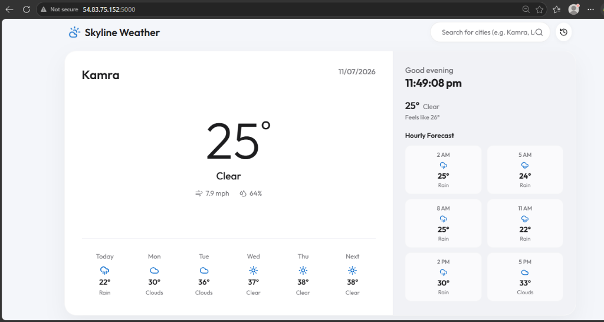
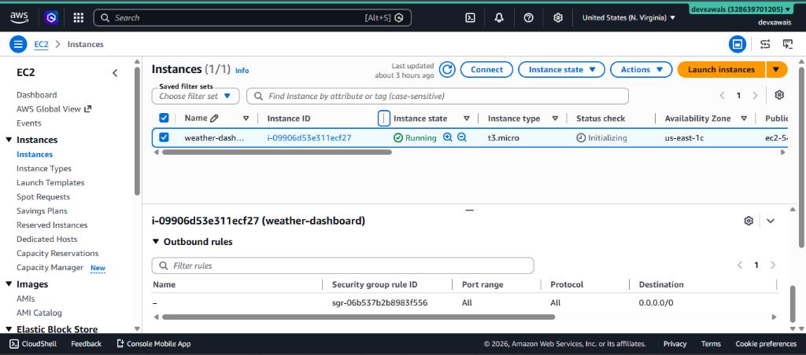
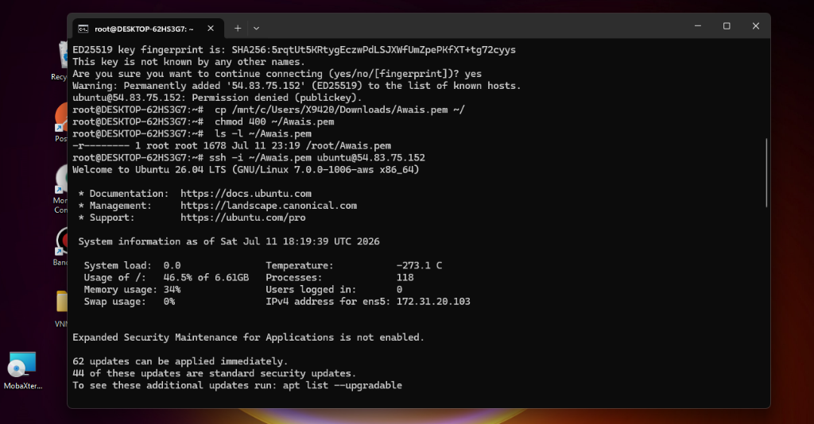
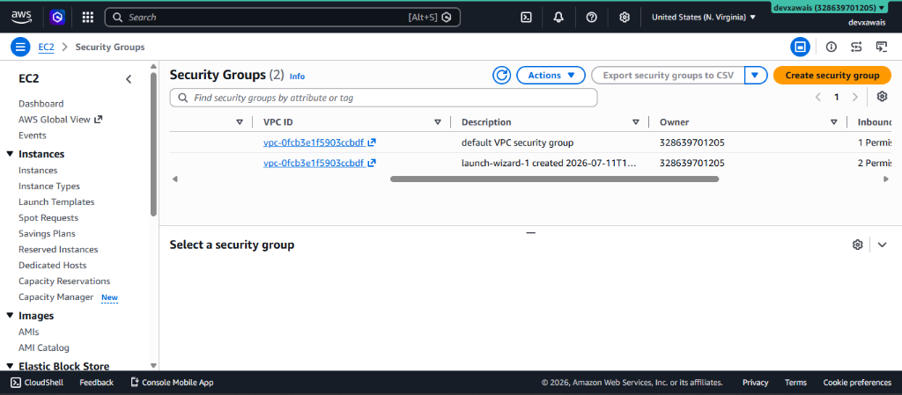
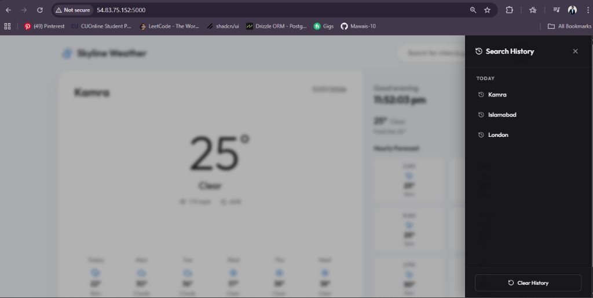

# Skyline Weather — Dashboard

A modern, premium weather dashboard built with **React.js** + **Vite** on the frontend and **Node.js** + **Express** on the backend. Features real-time weather data, hourly & weekly forecasts, search history with a collapsible sidebar, and a sleek glassmorphism UI — deployed on **AWS EC2**.



---


##  Testing the Project Locally

### 1. Clone this project

```bash
git clone https://github.com/devxawais/Skyline-Weather.git
```

### 2. Navigate into the project directory

```bash
cd Skyline-Weather
```

### 3. Set up environment variables

Create a `.env` file in the root directory:

```env
VITE_WEATHER_API_KEY=your_openweathermap_api_key_here
```

>  Get your free API key from [OpenWeatherMap](https://openweathermap.org/api)

### 4. Install dependencies & start the project

```bash
npm install
npm run dev
```

This runs both the **Vite frontend** (port 5173) and the **Express backend** (port 5000) concurrently.

---

##  Deploying on AWS EC2

### 1.  Set up an AWS EC2 Instance

1. **Create an IAM user** & login to your AWS Console
   - Access Type — Password
   - Permissions — Admin

2. **Create an EC2 instance**
   - Select an OS image — **Ubuntu**
   - Create a new key pair & download the `.pem` file
   - Instance type — **t3.micro**



---

### 2.  Connecting to the Instance using SSH

```bash
ssh -i your-key.pem ubuntu@<YOUR_EC2_PUBLIC_IP>
```

>  If you get a "Permission denied" error, set the correct permissions on your `.pem` file first:
>
> ```bash
> chmod 400 your-key.pem
> ```



---

### 3. Configuring Ubuntu on Remote VM

Once connected to the EC2 instance, update packages and install required tools:

```bash
# Update outdated packages & dependencies
sudo apt update && sudo apt upgrade -y

# Install Git
sudo apt install git -y

# Install Node.js (using NodeSource)
curl -fsSL https://deb.nodesource.com/setup_20.x | sudo -E bash -
sudo apt install nodejs -y

# Verify installations
node -v
npm -v
git --version
```

>  Detailed guides:
> - [Install Git — DigitalOcean](https://www.digitalocean.com/community/tutorials/how-to-install-git-on-ubuntu-22-04)
> - [Install Node.js — DigitalOcean](https://www.digitalocean.com/community/tutorials/how-to-install-node-js-on-ubuntu-22-04)

---

### 4.  Deploying the Project on AWS

#### Clone the project on the remote VM

```bash
git clone https://github.com/devxawais/Skyline-Weather.git
cd Skyline-Weather
```

#### Set up environment variables

```bash
nano .env
```

Add the following:

```env
VITE_WEATHER_API_KEY=your_openweathermap_api_key_here
```

#### Build the frontend & start the server

```bash
# Install dependencies
npm install

# Build the React frontend for production
npm run build

# Start the Express backend (serves built frontend + history API)
node server.js
```

>  **Tip:** Use a process manager like **PM2** to keep the server running in the background:
>
> ```bash
> sudo npm install -g pm2
> pm2 start server.js --name weather-dashboard
> pm2 startup
> pm2 save
> ```

---

### 5.  Configure Security Group (Inbound Rules)

You need to edit the **inbound rules** in the security group of your EC2 instance to allow traffic on port **5000**:

1. Go to **EC2 Dashboard** → **Security Groups**
2. Select the security group attached to your instance
3. Click **Edit inbound rules**
4. Add a rule:
   - Type: **Custom TCP**
   - Port Range: **5000**
   - Source: **0.0.0.0/0** (Anywhere IPv4)
5. Save the rules



---

### Project is Deployed on AWS! 🎉

Access the app at:

```
http://<YOUR_EC2_PUBLIC_IP>:5000
```




---


